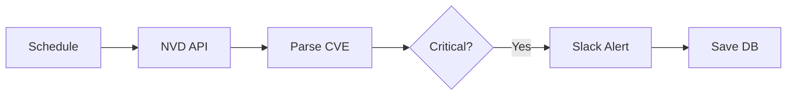

# 스크린샷 가이드

이 폴더는 n8n 워크플로우 설정 과정을 캡처한 이미지를 저장하는 곳입니다.

## 📸 추천 캡처 목록

실무 프로젝트로 보여주기 위해 다음 스크린샷을 추가하면 좋습니다:

### 1. n8n 워크플로우 전체 화면
- **파일명**: `workflow-overview.png`
- **내용**: 전체 워크플로우 노드 구성 (CVE 모니터링 + Nmap 스캔)
- **목적**: 자동화 시스템의 전체 흐름을 한눈에 보여줌

### 2. CVE 파싱 Function 노드
- **파일명**: `cve-function-node.png`
- **내용**: `parse-cve.js` 코드가 들어간 Function 노드 화면
- **목적**: JavaScript 코딩 능력 증명

### 3. Nmap 파싱 Function 노드
- **파일명**: `nmap-function-node.png`
- **내용**: `parse-nmap.js` 코드가 들어간 Function 노드 화면
- **목적**: 데이터 파싱 로직 시각화

### 4. Slack 알림 결과
- **파일명**: `slack-notification.png`
- **내용**: Slack 채널에 전송된 CVE/Nmap 알림 메시지
- **목적**: 실제 운영 중인 시스템처럼 보임

### 5. 실행 로그 화면
- **파일명**: `execution-log.png`
- **내용**: n8n 실행 로그 화면 (성공적으로 실행된 기록)
- **목적**: 안정적으로 동작하는 시스템 증명

### 6. 데이터베이스 저장 결과 (선택사항)
- **파일명**: `database-result.png`
- **내용**: PostgreSQL 또는 다른 DB에 저장된 스캔 결과
- **목적**: 데이터 영속성 관리 능력

## 📝 캡처 시 주의사항

### DO ✅
- **고해상도 캡처**: 1920x1080 이상 권장
- **클린 화면**: 브라우저 탭, 개인정보 제거
- **주요 부분 강조**: 중요한 부분에 빨간 박스나 화살표 추가
- **다크 모드 사용**: n8n 다크 테마가 더 전문적으로 보임

### DON'T ❌
- **민감한 정보 노출**: API 키, 실제 IP 주소, 도메인
- **지저분한 화면**: 여러 창이 겹쳐 있거나 알림이 많은 화면
- **테스트 데이터**: "test", "example" 같은 데이터는 피하기

## 🎨 권장 캡처 도구

- **Windows**: Snipping Tool, ShareX
- **Mac**: Command + Shift + 4
- **브라우저**: 브라우저 DevTools의 스크린샷 기능
- **전문 도구**: Snagit, LightShot

## 📐 이미지 사이즈 가이드

```
workflow-overview.png     → 1920x1080 (전체 화면)
cve-function-node.png     → 1280x800  (노드 상세)
nmap-function-node.png    → 1280x800  (노드 상세)
slack-notification.png    → 600x400   (메시지 캡처)
execution-log.png         → 1600x900  (로그 화면)
database-result.png       → 1200x600  (테이블 뷰)
```

## 💡 꿀팁

### README에 이미지 삽입 방법

```markdown
# 워크플로우 전체 구조


# CVE 파싱 로직

```

### 실제 스크린샷 대신 다이어그램 사용

스크린샷이 없는 경우, ASCII 다이어그램으로 대체:

```
[스케줄 트리거]
    ↓
[NVD API 호출] → [CVE 파싱] → [CRITICAL 체크] → [Slack 알림]
                                                    ↓
                                               [DB 저장]
```

또는 Mermaid 다이어그램:



## 🚀 프로 포트폴리오 팁

n8n 화면 캡처 시 다음을 보여주면 **"실무 경험 있음"**으로 인정받습니다:

1. **복잡한 워크플로우**: 10개 이상의 노드
2. **에러 핸들링**: Error Trigger 노드 포함
3. **주석 노드**: 각 노드에 설명 노트 추가
4. **실행 기록**: 성공적인 실행 로그 여러 개
5. **통합 서비스**: Slack, Email, DB 등 다양한 통합

---

**TIP**: 실제 n8n을 설치하지 않았다면, 이 폴더에 간단한 `PLACEHOLDER.txt` 파일을 넣고 "워크플로우 다이어그램 추가 예정"이라고 README에 명시하는 것도 방법입니다.
